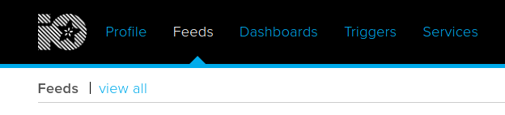
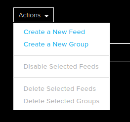
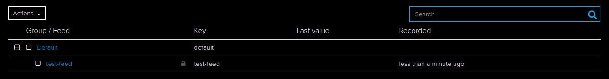
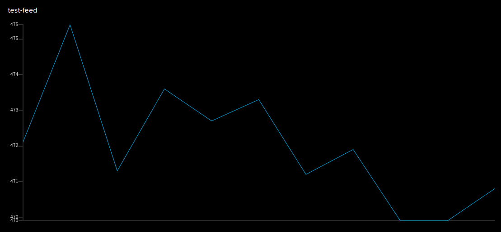

--- task ---

If you do not already have an account, navigate to https://io.adafruit.com/ and choose to sign up using the free option. Then fill out the form to create an account. Navigating back to https://io.adafruit.com/ main page

--- /task ---

--- task ---

Create a new feed by clicking on **Feeds** and selecting **view all** Create a new Feed by clicking on **Actions** and then **Create a New Feed**. Give your feed a name and description.




--- /task ---

--- task ---

Click on the icon to reveal **You secret AIO key**. You need the **scripting** constants, which will look something like:

```python
ADAFRUIT_IO_USERNAME = "your_username"
ADAFRUIT_IO_KEY = "aio_with_random_string"
```

--- /task ---

--- task ---

You need to install the `adafruit-io` python library

```bash
sudo pip3 install adafruit-io
```

--- /task ---

--- task ---

In your prefered Python IDE or texteditor, import the library and add in your credentials

```python
from Adafruit_IO import Client
aio = Client('ADAFRUIT_IO_USERNAME', 'ADAFRUIT_IO_KEY')
```

--- /task ---

--- task ---

You can send data to your feed using the `aio.send()` method. Your key can be viewed in the table of all fields.



```python
aio.send('key_of_feed', data_to_send)
```

--- /task ---

--- task ---

As you send data, it will be viewable when you click on the field you created.



--- /task ---

--- task ---

You can optionally create a dashboard to better display the feed, and additionally share the feed with others.

Have a look at the Adafruit guides for more information - https://learn.adafruit.com/series/adafruit-io-basics

--- /task ---


